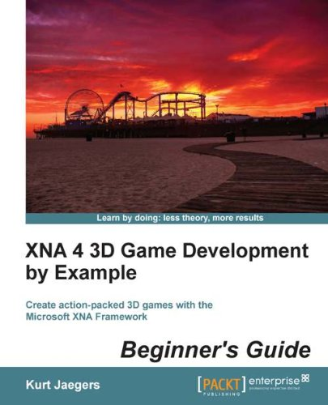
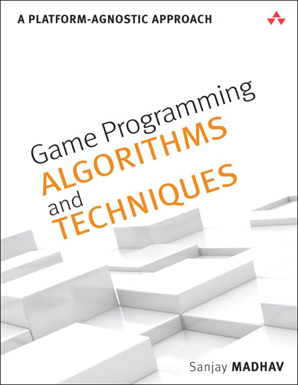

====== The Books ======

This page is here to help you find books which will help you on your MonoGame Journey.

They are in groups to show their core focus.

Unfortunately, some books were removed from Kindle, so, I have not included them here.

I only list books I have personally purchased a copy of.

A quick reminder, MonoGame is built on top of XNA 4.0, hence you should seek out XNA 4.0 related tutorials and books and they should work just fine.

I have added a list of third party [other community members] book recommendations below.

**__These are not affiliate links.__**

===== MonoGame [4] =====

----

Windows 8 and Windows Phone 8 Game Development 1st ed. Edition, Kindle Edition
by Adam Dawes (Author) 

https://amzn.eu/d/aLPrwS6

----

Beginning C# Programming with MonoGame Kindle Edition
by A.T. Chamillard (Author) 

https://amzn.eu/d/g51W42c

----

MonoGame Mastery: Build a Multi-Platform 2D Game and Reusable Game Engine 1st ed. Edition, Kindle Edition
by Jarred Capellman (Author), Louis Salin (Author, Contributor) 

https://amzn.eu/d/jetv8Fz

----

Game Development with MonoGame: Build a 2D Game Using Your Own Reusable and Performant Game Engine Kindle Edition
by Louis Salin (Author), Rami Morrar (Author) 

https://amzn.eu/d/41jefvw

----

===== XNA [6] =====

----

Microsoft XNA Game Studio Creator's Guide, Second Edition 2nd Edition, Kindle Edition
by Pat McGee (Author), Stephen Cawood (Author) 

https://amzn.eu/d/a3CoYob

----

XNA 4.0 Game Development by Example: Beginner's Guide Kindle Edition
by Kurt Jaegers (Author) 

https://amzn.eu/d/4gMp9v2

----

XNA 4 3D Game Development by Example: Beginner's Guide Kindle Edition
by Kurt Jaegers (Author) 

https://amzn.eu/d/9xbUW4W

----

XNA Game Studio 4.0 Programming: Developing for Windows Phone 7 and Xbox 360 (Developer's Library) Kindle Edition
by Tom Miller (Author), Dean Johnson (Author, Contributor) 

https://amzn.eu/d/9k5ihzd

----

Learning XNA 4.0: Game Development for the PC, Xbox 360, and Windows Phone 7 1st Edition, Kindle Edition
by Aaron Reed (Author) 

https://amzn.eu/d/71oKglB

----

Microsoft XNA 4.0 Game Development Cookbook Kindle Edition
by Luke Drumm (Author) 

https://amzn.eu/d/7f1Cu12

----

===== C# [4] =====

----

The C# Player’s Guide is a different kind of programming book.

https://csharpplayersguide.com/

----

C# Programming in easy steps, 3rd edition: Modern coding with C# 10 and .NET 6. Updated for Visual Studio 2022 Kindle Edition
by Mike McGrath (Author) 

https://amzn.eu/d/bD2a9q0

----

Learning C# by Programming Games 2013th Edition, Kindle Edition
by Arjan Egges (Author), Jeroen D. Fokker (Author), Mark H. Overmars (Author) 

https://amzn.eu/d/fP4ncoB

----

Learning C# by Programming Games 2nd Edition, Kindle Edition
by Wouter van Toll (Author), Arjan Egges (Author), Jeroen D. Fokker (Author) 

https://amzn.eu/d/g4ZuxFK

----

===== Game Development [9] =====

----

----

----

The Book that started it all for me:

The Computer Game Design Course: Principles, Practices and Techniques for the Aspiring Game Designer Paperback – 23 April 2007
by Jim Thompson (Author), Barnaby Berbank-Green (Author)

https://amzn.eu/d/8vl4lLs

----

----

----

This is also, though not the edition, the other book which started my game development journey.

Game Engine Architecture Hardcover – 29 Sept. 2014
by Jason Gregory (Author)

https://amzn.eu/d/gl9o1Bc

----

----

----

Multiplayer Game Programming: Architecting Networked Games (Game Design) 1st Edition, Kindle Edition
by Josh Glazer (Author), Sanjay Madhav (Author) 

https://amzn.eu/d/f89gkxq

----

Game Programming Algorithms and Techniques: A Platform-Agnostic Approach (Game Design) 1st Edition, Kindle Edition
by Sanjay Madhav (Author) 

https://amzn.eu/d/fJg0EDs

----

Game Programming Patterns Paperback – 2 Nov. 2014
by Robert Nystrom (Author)

https://amzn.eu/d/19dbTAK

----

Fundamentals of Shooter Game Design: Advanced Game Design (Voices That Matter) 1st Edition, Kindle Edition
by Ernest Adams (Author), Joris Dormans (Author) 

https://amzn.eu/d/8qbd7iX

----

Fundamentals of Game Design 3rd Edition, Kindle Edition
by Ernest Adams (Author) 

https://amzn.eu/d/b3W23sl

----

Game Engine Design and Implementation: Foundations of Game Development Paperback – Illustrated, 25 Aug. 2010
by Thorn (Author)

https://amzn.eu/d/aUQCtMr

----

The Game Production Handbook 3rd Edition Paperback – Illustrated, 23 April 2013
by Chandler (Author)

https://amzn.eu/d/5dPMBmp

----

====== Third Party Books ======

Here you will find a list of books recommended by other community members.

----

Recommended by black_mage

Functional Programming in C#, Second Edition Kindle Edition
by Enrico Buonanno (Author) 

https://amzn.eu/d/am9VSs9

----
