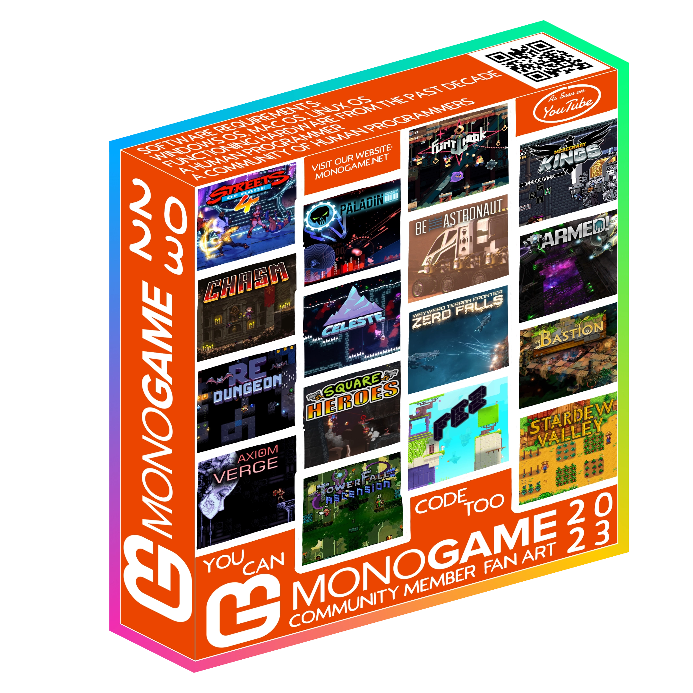
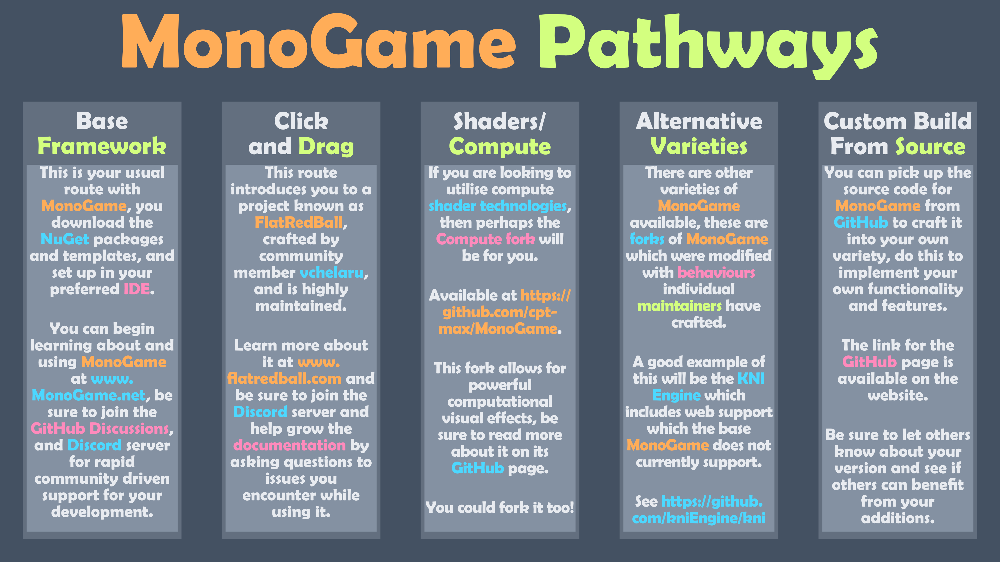

====== MonoGame Community Wiki ======

==== Hi! Welcome to the Community! ====

----
First and foremost, this wiki is in no way affiliated with the official MonoGame site, it is a project started by a member of the community, intended to be a resource for people looking to find solutions and learn more about using [MonoGame](monogame/monogame.md).
----

As the host I will be populating this service with content as best and frequently as I can.
I personally find the need for a single location for solutions to my constant repeat issues, and figured a snippet collection with detailed explanations was the place to go.
I will also collate code discovered via other sites and do my best to document the links and more.
I will also create helpful graphics to go along with code where appropriate to instil the information being presented.
Anyway, enough blabbering for now, I hope I can keep this alive and functional long enough.

Happy Coding!

**MrValentine.**

===== MonoGame Routes =====

===== MonoGame =====

See the MonoGame page [here](monogame/monogame.md).

===== Useful Images =====

Here you will find images which should clarify or guide you through the world of MonoGame.

[Useful Images](usefulimages/usefulimages.md) page.

===== The Magazine =====

Download the latest Magazine on the dedicated page.

[Magazine](magazine/magazine.md) page.

===== The Books =====

A list of recommended books for both C# and MonoGame [XNA].

[Books](books/books.md) page..

===== The Tutorials =====

Yes, it is finally here, and yes this will be the text on this section for a long while until I eventually notice it and edit it in future.

[Tutorials](tutorials/tutorials.md) page..

===== Game Jam Manual =====

Download the Game Jam Manual on the Gam Jam Manual page.

[Game Jam Manual](gamejammanual/gamejammanual.md) page.

===== MonoGame on the Web =====

I will collate content relating to using MonoGame in a browser [here](monogame/monogameontheweb.md).

===== Stuff to organise in future =====

Here is a collection of posts made on the Discord Forum during its short brief life, meant to be reposted to the GitHub Discussions at some point in time. might just link to here, over there in future.

[Forum Related](forum_related.md) page..

===== Announcements =====

I will add [announcements](announcements/announcements.md) here, and on the dedicated page.

===== This Project Began: =====

==== July 26th 2023 ====