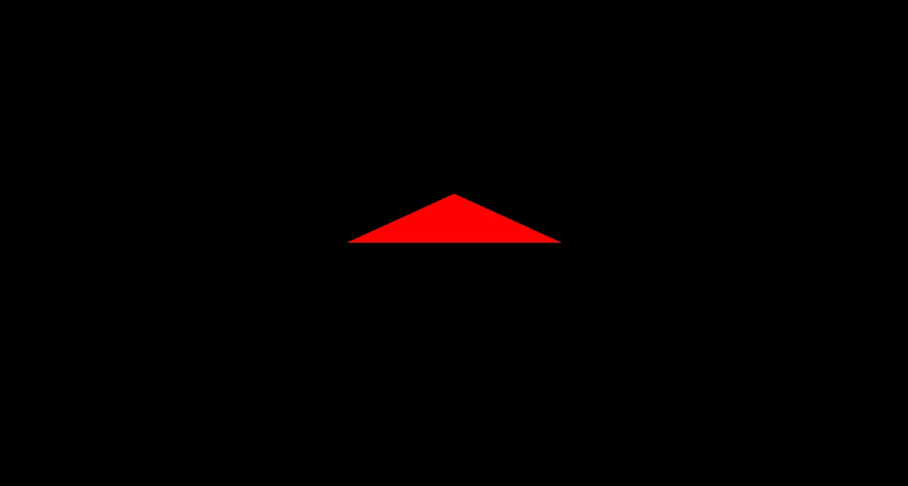
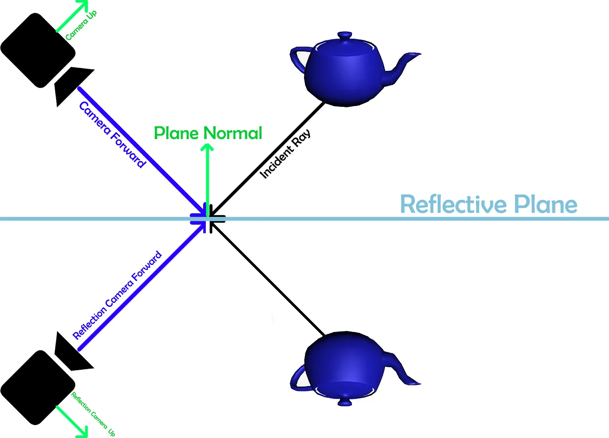
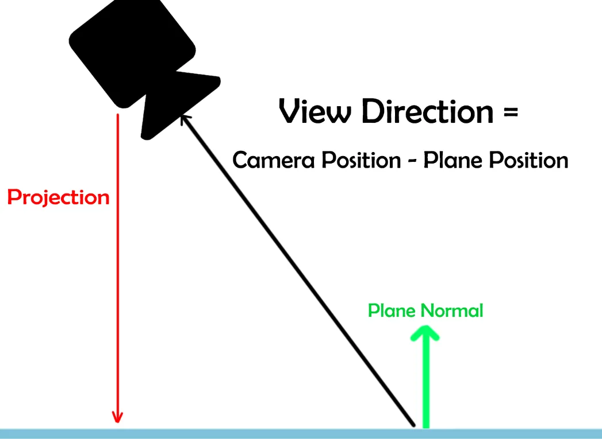
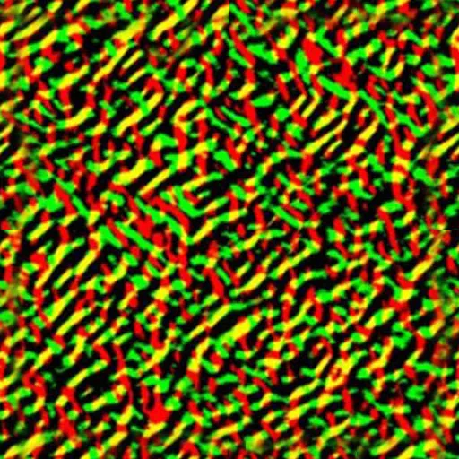
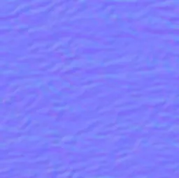
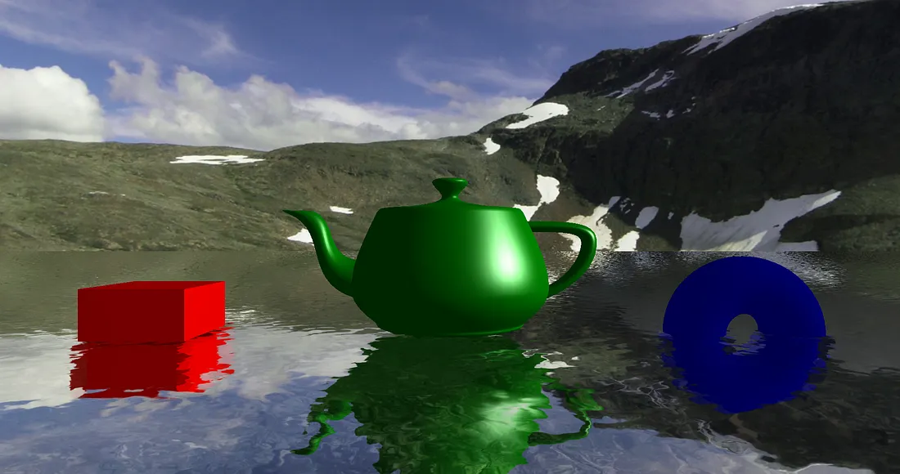

====== Garanks Tutorials ======

Below is a collection of permitted copies of Garanks tutorials from their Medium account, see: <a href="../tutorials/tutorials.md"> Tutorials.md</a> for the base source link.


----
====== How to create a simple triangle in Monogame/XNA ======

Mar 29, 2024

Source: https://medium.com/@gabriel.enrique.digiorgio/how-to-create-water-shader-in-monogame-xna-0a7e82092c85

===== Introduction =====

In this tutorial, we’ll cover one of the //fundamental// building blocks of 3D and 2D graphics: creating a simple triangle. Whether you’re a beginner eager to dive into the realm of game programming or an experienced developer seeking to refresh your skills, understanding how to generate basic shapes like a triangle lays a solid foundation for more complex designs.

===== Setting Up the Game Environment =====

Before we dive into creating our triangle, let’s set up our game environment. In the ''%%Initialize%%'' method, we initialize our view and projection matrices, which are essential for rendering objects in a 3D space.

```csharp
private Matrix _view;
private Matrix _projection;

protected override void Initialize()
{
    // Set up view and projection matrices
    _view = Matrix.CreateLookAt(Vector3.One * 5, Vector3.Zero, Vector3.Up);
    _projection = Matrix.CreatePerspectiveFieldOfView(MathHelper.PiOver4, 
    GraphicsDevice.Viewport.AspectRatio, 0.1f, 25000f);

    // Adjust the back buffer size
    _graphics.PreferredBackBufferWidth =
     GraphicsAdapter.DefaultAdapter.CurrentDisplayMode.Width - 100;
    _graphics.PreferredBackBufferHeight = 
    GraphicsAdapter.DefaultAdapter.CurrentDisplayMode.Height - 100;
    _graphics.ApplyChanges(); 
}
```

===== Vertices =====

In order to create a triangle we’ll need to declare our vertices. To do this, we’ll simply create an array to store them in the ''%%Initialize%%'' method.

```csharp
protected override void Initialize()
{
    var vertices = new VertexPosition[]
    {
        new VertexPosition(new Vector3(-1, 0, -1)),
        new VertexPosition(new Vector3(-1, 0, 1)),
        new VertexPosition(new Vector3(1, 0, -1)),
    };

    base.Initialize();
}
```

In this example I’ve used ''%%VertexPosition%%'' to only send information about the position of the vertex, but you can also use ''%%VertexPositionColor%%'' (where you can also send information about color), ''%%VertexPositionColorNormal%%'', etc.

===== Vertex Buffer =====

To begin with, we need to set up a vertex buffer. This structure is responsible for storing a large number of vertices in the GPU’s memory.

```csharp
private VertexBuffer _vertexBuffer;

protected override void Initialize()
{
    var vertices = new VertexPosition[]
    {
        new VertexPosition(new Vector3(-1, 0, -1)),
        new VertexPosition(new Vector3(-1, 0, 1)),
        new VertexPosition(new Vector3(1, 0, -1)),
    };

    _vertexBuffer = new VertexBuffer(GraphicsDevice, 
    VertexPosition.VertexDeclaration, 3, BufferUsage.None);
    _vertexBuffer.SetData(vertices);

    base.Initialize();
}
```

In the provided code snippet, we initialize the vertex buffer ''%%_vertexBuffer%%'' with an array of ''%%VertexPosition%%'' objects. Each ''%%VertexPosition%%'' specifies a position in 3D space using a ''%%Vector3%%'' coordinate. For simplicity, we define a triangle with three vertices positioned at (-1, 0, -1), (-1, 0, 1), and (1, 0, -1) respectively.

Once the vertex data is defined, we create the ''%%VertexBuffer%%'' object using the ''%%GraphicsDevice%%'' and specify the vertex declaration (''%%VertexPosition.VertexDeclaration%%''). The buffer is allocated with enough space to store three vertices (3 in this case), and the vertex data is set using the ''%%SetData%%'' method.

===== Drawing the triangle =====

Now, let’s proceed with rendering our triangle. In the code snippet below, we’ll integrate our basic shader and define how the triangle will be drawn.

Firstly, we need to have a shader and load it, using the ''%%LoadContent%%'' method. We’ll create a “BasicShader” which is a straightforward shader that defines basic transformations and coloring for our vertices. It consists of a vertex shader and a pixel shader.

```csharp
public const string ContentFolderEffects = "Effects/";
private Effect _effect;

protected override void LoadContent()
{
    _effect = Content.Load<Effect>(ContentFolderEffects + "BasicShader");
}
```

And this will be our “BasicShader”:

```csharp
float4x4 World;
float4x4 View;
float4x4 Projection;

float3 DiffuseColor;

struct VertexShaderInput
{
    float4 Position : POSITION0;
};

struct VertexShaderOutput
{
    float4 Position : SV_POSITION;
};

VertexShaderOutput MainVS(in VertexShaderInput input)
{
    VertexShaderOutput output = (VertexShaderOutput)0;

    float4 worldPosition = mul(input.Position, World);
    float4 viewPosition = mul(worldPosition, View);
    output.Position = mul(viewPosition, Projection);

    return output;
}

float4 MainPS(VertexShaderOutput input) : COLOR
{
    return float4(DiffuseColor, 1.0);
}

technique BasicColorDrawing
{
 pass P0
 {
  VertexShader = compile VS_SHADERMODEL MainVS();
  PixelShader = compile PS_SHADERMODEL MainPS();
 }
};
```

Now, let’s move on to drawing the triangle in the ''%%Draw%%'' method:

```csharp
protected override void Draw(GameTime gameTime)
{
    GraphicsDevice.Clear(Color.Black);

    // Set shader parameters
    _effect.Parameters["World"].SetValue(Matrix.Identity);
    _effect.Parameters["View"].SetValue(_view);
    _effect.Parameters["Projection"].SetValue(_projection);
    _effect.Parameters["DiffuseColor"].SetValue(Color.Red.ToVector3());

    // Set rasterizer state
    var rasterizerState = RasterizerState.CullNone;
    GraphicsDevice.RasterizerState = rasterizerState; 

    // Set vertex buffer
    GraphicsDevice.SetVertexBuffer(_vertexBuffer);
    
    // Begin drawing
    foreach (var pass in _effect.CurrentTechnique.Passes)
    {
        pass.Apply();

        // Draw the triangle
        GraphicsDevice.DrawPrimitives(PrimitiveType.TriangleList, 0, 1);
    }

    base.Draw(gameTime);
}
```

In this ''%%Draw%%'' method, we start by clearing the screen with a black color. Then, we set up our shader parameters such as the world, view, and projection matrices, along with the diffuse color. We also configure the rasterizer state to ensure proper rendering.

Next, we set the vertex buffer to define the geometry we want to draw. Finally, within the loop iterating over each pass of our shader technique, we apply the shader and use ''%%DrawPrimitives%%'' to render the triangle defined by our vertex buffer.

In this method call, ''%%PrimitiveType.TriangleList%%'' specifies the type of primitive being drawn, which in this case is a triangle. The second parameter, ''%%0%%'', indicates the starting index in the vertex buffer from which vertices will be fetched for drawing. Lastly, ''%%1%%'' specifies the number of primitives to draw. Here, we're drawing a single triangle, but this number can be increased to draw multiple primitives. This method is crucial for converting vertex data into visual geometry on the screen.

With this setup, our triangle should now be displayed on the screen using the specified shader and parameters.

<a href="../../../content/tutorials/garank/1_y0prqffpsunj3llyjaisha.webp" download>
  
</a>

__Red triangle__

----
----

====== How to create Water shader in Monogame/XNA ======

[Some editing of the code blocks made to avoid side scrolling on desktops]

May 20, 2024

https://medium.com/@gabriel.enrique.digiorgio/how-to-create-water-shader-in-monogame-xna-0a7e82092c85

Video: https://youtu.be/ICX9RCThTH8

GitHub: https://github.com/gabdigiorgio/water

===== Introduction =====

In this article we’ll cover the basics on creating a simple water shader in Monogame/XNA. This shader will make use of: //planar reflections//, //refraction//, //Fresnel effect// and //specular highlights//. At the time of writing, it was done with //Monogame version 3.8.1//. Here’s the [[https://github.com/gabdigiorgio/water|source code]] if you want to examine every aspect of it in detail.

===== The basics =====

To understand better how our shader works we’re gonna split it up in a few steps:

  * Adding a //quad///flat surface.
  * Adding a //reflection// and //refraction// texture (lerping between them using Fresnel effect).
  * Simulate small waves with a //distortion map//.
  * Adding a //normal map// for //specular// highlights.

===== Drawing =====

The sequence of rendering steps is as follows:

  - Drawing the //refraction//
  - Drawing the //reflection//
  - Drawing the //water//
  - Drawing //other objects// in the scene

This order ensures that each component is rendered in the correct sequence to achieve the desired visual effect.

===== Setting up the code =====

In order to correctly achieve our water shader technique, we’ll need to set up some things in our code. To simplify the explanation I’ll use an already defined class called ''%%QuadPrimitive%%'' that will have a vertex buffer (sending information about normals and texture coordinates) and, of course, an index buffer. I’ll also use a ''%%FreeCamera%%'' class to handle our camera movement, though we won't delve into its details as it's not the focus of this tutorial.

Firstly we will //create// our //quad//, its //world matrix//, its //height// and the //wave speed//. We will use the wave speed later on the shader parameters. Also, this height will be important when calculating the reflection and refraction. Additionally, we’ll declare our shader

```csharp
// Camera
private FreeCamera _freeCamera;
private readonly Vector3 _cameraInitialPosition = new(0f, 50f, 300f);

// Water
private QuadPrimitive _quad;
private const float QuadHeight = 0f;
private const float WaveSpeed = 0.05f;
private Matrix _quadWorld;
private Effect _waterShader;
```

And our ''%%Initialize%%'' method should look something like this:

```csharp
protected override void Initialize()        
{
  _graphicsDeviceManager.PreferredBackBufferWidth = 
  GraphicsAdapter.DefaultAdapter.CurrentDisplayMode.Width - 100;
  _graphicsDeviceManager.PreferredBackBufferHeight = 
  GraphicsAdapter.DefaultAdapter.CurrentDisplayMode.Height - 100;
  _graphicsDeviceManager.ApplyChanges();

  // Camera
  _freeCamera = new FreeCamera(GraphicsDevice.Viewport.AspectRatio, _cameraInitialPosition);
  
  // Water
  _quad = new QuadPrimitive(GraphicsDevice);
  var quadPosition = new Vector3(0f, QuadHeight, 0f);
  _quadWorld = Matrix.CreateScale(3000f, 0f, 3000f) * Matrix.CreateTranslation(quadPosition);
  
  base.Initialize();
}
```

===== Planar Reflections =====

Before we proceed with our code, we need to understand how planar reflections work. Here’s an example of what a planar reflection looks like:

<a href="../../../content/tutorials/garank/1_pejesfe49mymteta1nhcrg.webp" download>
  
</a>

__Planar reflection graphical example__

In this example we can see that, given a a //reflective plane//, a //camera// and some object, the //reflection// should look something like that.

To translate this later to code we need to calculate a new view matrix from the point of view of the //Reflection Camera// (the one under the reflective plane).

==== Reflection Camera Position ====

First, we’ll be calculating the //Reflection Camera Position//. We already know the //Camera Position//, the //Plane Position// and the //Plane Normal//, so if we substract the Plane Position from the Camera position, we obtain the //View Direction vector//:

```csharp
View Direction = Camera Position — Plane Position
<a href="../../../content/tutorials/garank/1_jyfhc1_5dbxgllx6zrb3xg.webp" download>
  
</a>
__View direction vector__

As you can see I’ve also added another vector wich is the //Projection vector//. Then we can use the //length// of that projection to find the distance to that point in the plane.

With that, we now have a rectangular triangle. The //Projection Length// should be equal to:

```csharp
Projection Length = View Direction * cos(Angle)
```

The Angle refers as the angle between the Plane Normal and the View Direction

To simplify it we can rewrite it like this:

```csharp
Projection Length = Dot Product(Plane Normal, View Direction)
```

Great, now we have the Projection Lenght. We can use that to obtain the //Reflection Camera Position//:

```csharp
Reflection Camera Position = Camera Position — 2 * Plane Normal * Projection Length
```

==== Reflection Camera View Matrix ====

In order to achieve the Reflection Camera View Matrix, we’ll need to calculate the //Reflection Camera Forward//. We can use the function ''%%Reflect(vector, normal)%%'' to get the reflection of a vector off a surface that has the specified normal.

```csharp
Reflection Camera Forward = Vector3.Reflect(Camera Forward, Plane Normal)
```

After calculating the //Reflection Camera Forward//, the next step is to compute the //Reflection Camera Up//. We’ll again use the ''%%Vector3.Reflect%%'' function to reflect the camera's up vector off the plane's normal.

```csharp
Reflection Camera Up = Vector3.Reflect(Camera Up, Plane Normal)
```

With both the //Reflection Camera Position//, //Reflection Camera Forward// and //Reflection Camera Up// vectors calculated, we now have all the components necessary to construct the //Reflection Camera View Matrix//.

```csharp
Reflection Camera View = 
Matrix.CreateLookAt(
Reflection Camera Position, 
Reflection Camera Position + 
Reflection Camera Forward, 
Reflection Camera Position)
```

===== Drawing the Reflection =====

Now that we’ve calculated the necessary components for the Reflection Camera View Matrix, we can proceed to //draw the reflection onto a texture//, typically a ''%%RenderTarget2D%%''. To accomplish this in our code, we can integrate the previously calculated values into our rendering process. The following snippet demonstrates how this can be achieved:

```csharp
 private void DrawReflection(Matrix world, Matrix view, Matrix projection, GameTime gameTime)
 {
    // Set the render target to the Reflection Texture
    GraphicsDevice.SetRenderTarget(_reflectionRenderTarget);
    GraphicsDevice.Clear(ClearOptions.Target | 
    ClearOptions.DepthBuffer, Color.CornflowerBlue, 1f, 0);
            
    var quadNormal = Vector3.Up;         
    var viewDirection = _freeCamera.Position - _quadWorld.Translation;       
    var projLength = Vector3.Dot(quadNormal, viewDirection);
    var reflectionCamPos = _freeCamera.Position - 2 * quadNormal * projLength;
    var reflectionCamForward = Vector3.Reflect(_freeCamera.FrontDirection, 
    quadNormal);
    var reflectionCamUp = Vector3.Reflect(_freeCamera.UpDirection, quadNormal);  
    var reflectionCamView = Matrix.CreateLookAt(reflectionCamPos, 
                reflectionCamPos + reflectionCamForward, reflectionCamUp);
    
    // Draw the scene from the reflection camera point of view
    DrawScene(reflectionCamView, projection, reflectionCamPos, 
    _reflectionClippingPlane);
    
    // Reset the render target to the default (screen)
    GraphicsDevice.SetRenderTarget(null);
         
    // Draw the water
    DrawWater(world, view, projection, reflectionCamView, gameTime);
}
```

In the ''%%DrawWater%%'' method we’ll pass the necessary parameters, which we’ll delve into in detail later.

==== Clipping Planes ====

If you’ve noticed, there’s a clipping plane ''%%_reflectionClippingPlane%%'' that hasn’t been explained yet. Let’s dive into its purpose. This clipping plane is used to draw only objects above the water surface. This ensures that only the upper half of objects is reflected in the water, as is typically observed in realistic reflections. You can declare it like this:

```csharp
private readonly Vector4 _reflectionClippingPlane = new(0f, 1f, 0f, -QuadHeight);
```

This plane is defined by a mathematical equation //(Ax + By + Cz + D = 0)//, where (A, B, C) represents the normal vector perpendicular to the plane, and D is the distance from the origin along that normal vector.

In our case, the water surface acts as a //flat plane parallel to the XZ plane//, with its //normal vector// pointing directly //upwards (0, 1, 0)//.

We utilize the value //-QuadHeight// in the reflection clipping plane equation specifically for the shader handling objects within the water. This value is later employed in the pixel shader using the ''%%clip%%'' function, where we’ll clip the pixels below the Reflection Plane. Here’s an example:

```csharp
// Uniforms
float4 ClippingPlane;

struct VertexShaderInput
{
    float4 Position : POSITION0;
    float4 Normal : NORMAL;
};
 
struct VertexShaderOutput
{
    float4 Position : POSITION0;
    float3 WorldPosition : TEXCOORD0;
    float3 Normal : TEXCOORD1;
    float4 Clipping : TEXCOORD2;
};

VertexShaderOutput MainVS(VertexShaderInput input)
{
    VertexShaderOutput output = (VertexShaderOutput) 0;
 
    float4 worldPosition = mul(input.Position, World);
    float4 viewPosition = mul(worldPosition, View);
    output.Position = mul(viewPosition, Projection);
    output.WorldPosition = worldPosition;
    output.Normal = mul(input.Normal, InverseTransposeWorld);
    /*
    Distance from the vertex to the clipping plane using dot product
    The resulting distance will be used to decide whether to discard 
    the corresponding pixel in the pixel shader
    */
    output.Clipping = dot(worldPosition, ClippingPlane);
 
    return output;
}

float4 MainPS(VertexShaderOutput input) : COLOR0
{
    clip(input.Clipping);
    
    // Rest of the pixel shader
}
```

The ''%%clip%%'' function is responsible for discarding pixels based on a given condition. By utilizing ''%%-QuadHeight%%'' in our shader, we ensure that pixels representing objects below the water surface are discarded during rendering, effectively clipping them from the final reflection image.

Also this works when we want to discard the pixels from above the water, in that case, for the refraction:

```csharp
private readonly Vector4 _refractionClippingPlane = new(0f, -1f, 0f, QuadHeight);
```

===== Refraction =====

Drawing the refraction onto a render target is a straightforward process, especially when compared to rendering reflections. It involves rendering the scene from the perspective of the camera while utilizing the ''%%_refractionClippingPlane%%'' to discard pixels above the water surface.

```csharp
private void DrawRefraction()
{
    // Set the render target to the Refraction Texture
    GraphicsDevice.SetRenderTarget(_refractionRenderTarget);
    GraphicsDevice.Clear(ClearOptions.Target | 
    ClearOptions.DepthBuffer, Color.CornflowerBlue, 1f, 0);
            
    // Draw the scene normally but clipping the objects above the water
    DrawScene(_freeCamera.View, _freeCamera.Projection, _freeCamera.Position, 
    _refractionClippingPlane);
            
    // Reset the render target to the default (screen)
    GraphicsDevice.SetRenderTarget(null);
}
```

Great, now we can proceed to the //actual water shader// and see how all of this comes together.

===== Water Shader =====

First, we’ll declare the necessary uniforms and textures for our water shader. These include parameters for lighting, camera position, water movement, and texture samplers for the various maps we’ll use:


```csharp
float KSpecular;
float Shininess;
float3 LightPosition;
float3 LightColor;
float3 CameraPosition;

float MoveFactor;
float2 Tiling;
float WaveStrength;

float4x4 ReflectionView;
float4x4 Projection;
float4x4 WorldViewProjection;
float4x4 World;

texture RefractionTexture;
sampler2D refractionSampler = sampler_state
{
    Texture = (RefractionTexture);
    ADDRESSU = Clamp;
    ADDRESSV = Clamp;
    MINFILTER = Linear;
    MAGFILTER = Linear;
    MIPFILTER = Linear;
};

texture ReflectionTexture;
sampler2D reflectionSampler = sampler_state
{
    Texture = (ReflectionTexture);
    ADDRESSU = Clamp;
    ADDRESSV = Clamp;
    MINFILTER = Linear;
    MAGFILTER = Linear;
    MIPFILTER = Linear;
};

texture DistortionMap;
sampler2D distortionSampler = sampler_state
{
    Texture = (DistortionMap);
    ADDRESSU = WRAP;
    ADDRESSV = WRAP;
    MINFILTER = Linear;
    MAGFILTER = Linear;
    MIPFILTER = Linear;
};

texture NormalMap;
sampler2D normalMapSampler = sampler_state
{
    Texture = (NormalMap);
    ADDRESSU = WRAP;
    ADDRESSV = WRAP;
    MINFILTER = Linear;
    MAGFILTER = Linear;
    MIPFILTER = Linear;
};
```

In this shader, the uniforms ''%%KSpecular%%'', ''%%Shininess%%'', ''%%LightPosition%%'', ''%%LightColor%%'', and ''%%CameraPosition%%'' define the lighting and viewing parameters. The ''%%MoveFactor%%'', ''%%Tiling%%'', and ''%%WaveStrength%%'' control the water's movement and appearance. The matrices ''%%ReflectionView%%'', ''%%Projection%%'', ''%%WorldViewProjection%%'', and ''%%World%%'' are used for transforming coordinates. The texture samplers ''%%refractionSampler%%'', ''%%reflectionSampler%%'', ''%%distortionSampler%%'', and ''%%normalMapSampler%%'' are used to sample the respective textures needed for rendering the water surface.

For the //Distortion Map// we’ll use a texture that looks like this:

<a href="../../../content/tutorials/garank/1_ant9-odsyiryo7ty_utx1w.webp" download>
  
</a>

__Distortion Map Texture__

By using this texture we can //distort// the //texturee coordinates//, creating the effect of small waves on the water surface. This distortion helps to simulate the dynamic and realistic appearence of water

For the //Normal Map// we’ll use another texture, like this:

<a href="../../../content/tutorials/garank/1_mz-hrsldcrhz5adzjfxeig.webp" download>
  
</a>

__Normal Map Texture__

Normal Map Texture
This map contains information about the //surface normals//, which are essential for simulating the way light interacts with the water. Unlike the distortion map, which is used to manipulate texture coordinates, the normal map is used for light-related calculations.

===== Vertex Shader =====

In our vertex shader, we transform the vertex data to prepare it for the pixel shader. Here’s a breakdown of the process:

```csharp
struct VertexShaderInput
{
    float4 Position : POSITION0;
    float4 Normal : NORMAL;
    float2 TextureCoordinates : TEXCOORD0;
};

struct VertexShaderOutput
{
    float4 Position : SV_POSITION;
    float2 TextureCoordinates : TEXCOORD0;
    float4 WorldPosition : TEXCOORD1;
    float4 Normal : TEXCOORD2;
    float4 ReflectionPosition : TEXCOORD3;
    float4 RefractionPosition : TEXCOORD4;
};

VertexShaderOutput MainVS(in VertexShaderInput input)
{
    VertexShaderOutput output = (VertexShaderOutput) 0;

    // Transform the vertex position to clip space
    output.Position = mul(input.Position, WorldViewProjection);
    
    // Transform the vertex position to world space
    output.WorldPosition = mul(input.Position, World);
    
    // Pass the vertex normal without any changes
    output.Normal = input.Normal;
    
    // Adjust texture coordinates by the tiling factor
    output.TextureCoordinates = input.TextureCoordinates * Tiling;
    
    // Calculate the reflection position and world matrix
    float4x4 reflectProjectWorld = mul(ReflectionView, Projection);
    reflectProjectWorld = mul(World, reflectProjectWorld);
    output.ReflectionPosition = mul(input.Position, reflectProjectWorld);
    
    // The refraction position is the same as the clip space position
    output.RefractionPosition = output.Position;
    
    return output;
}
```

Excellent, with this, we’ve finished the vertex shader part, and we can move on to the pixel shader.

===== Pixel Shader =====

==== Projective Texture Mapping ====

Firstly, we transform the projective refraction texture coordinates to Normalized Device Coordinates (NDC) space. Then, we scale and offset the xy coordinates appropriately to ensure accurate sampling of a DirectX (DX) texture.

```csharp
float4 MainPS(VertexShaderOutput input) : COLOR
{     
    // Refraction

    float4 refractionTexCoord;
    refractionTexCoord = input.RefractionPosition;
    
    // Screen position coords
    refractionTexCoord.xyz /= refractionTexCoord.w;
    
    // Adjust offset
    refractionTexCoord.x = 0.5f * refractionTexCoord.x + 0.5f;
    refractionTexCoord.y = -0.5f * refractionTexCoord.y + 0.5f;
    
    // Refract more based on distance from the camera
    refractionTexCoord.z = 0.001f / refractionTexCoord.z;
    float2 refractionTex = refractionTexCoord.xy - refractionTexCoord.z;
    
    // Reflection
   
    float4 reflectionTexCoord;
    reflectionTexCoord = input.ReflectionPosition;
    
    // Screen position coords
    reflectionTexCoord.xyz /= reflectionTexCoord.w;
    
    // Adjust offset
    reflectionTexCoord.x = 0.5f * reflectionTexCoord.x + 0.5f;
    reflectionTexCoord.y = -0.5f * reflectionTexCoord.y + 0.5f;
    
    // Reflect more based on distance from the camera
    reflectionTexCoord.z = 0.001f / reflectionTexCoord.z;
    float2 reflectionTex = reflectionTexCoord.xy + reflectionTexCoord.z;

    // Rest of the shader
}
```

For the //refraction//, we adjust the texture coordinates based on the distance from the camera to enhance the refraction effect. This adjustment ensures that objects farther from the camera refract more, contributing to a more realistic rendering of underwater scenes.

Similarly, for the //reflection//, we transform the reflection texture coordinates to NDC space and adjust them based on the distance from the camera. This helps to create a convincing reflection effect, with objects farther from the camera reflecting more prominently.

==== Distortion Map / DuDv Map ====

Now, we are going to sample both the reflection and refraction textures using the Distortion Map shown above.

This map are conformed by //red and green// colors, basically a float2.

However, this values are always going to be positive in this Distortion Map, so our distortions //would always be positive//, the values are between (0.0,0.0) and (1.0,1.0). We want to be able to have //both positive and negative// distortions for this to look realistic.

In order to convert these values to be between (-1.0,-1.0) and (1.0,1.0) we simply multiply by 2 and subtract 1. With that, we use that to distort the //Reflection and Refraction texture coordinates// by simply adding the distortion onto those texture coordinates.

```csharp
float2 distortion = (tex2D(distortionSampler, Input.TextureCoordinates)).rg 
                    * 2.0 - 1.0) * WaveStrength;

reflectionTex += distortion;
refractionTex += distortion;
```

This distortion might be a little strong by default so we’ll use the uniform we previously declared as ''%%WaveStrength%%'' in order to lesser a bit the distortion.

==== Moving the waves ====

The way we are going get the water to look like it’s moving, is //using an offset// for where we sample the Distortion Map. We’ve already declared that, which is the ''%%MoveFactor%%'' and we’re going to change this offset over time.

To achieve this effect, we add the //MoveFactor// to the //X// component of the texture coordinates and sample the distortion map. Afterward, we perform a //second sampling// for the //Y// component, applying an additional distortion in a //different direction//. This process enhances the realism of the distortion effect, creating a more dynamic appearance.

```csharp
float2 distortedTexCoords = tex2D(distortionSampler, float2(input.TextureCoordinates.x + 
MoveFactor, input.TextureCoordinates.y)) * 0.01;
distortedTexCoords = input.TextureCoordinates + 
float2(distortedTexCoords.x, distortedTexCoords.y + MoveFactor);
float2 totalDistortion = 
(tex2D(distortionSampler, distortedTexCoords).rg * 2.0 - 1.0) * WaveStrength;

reflectionTex += totalDistortion;
refractionTex += totalDistortion;

// Sample both texture using the distorted texture coordinates
float4 reflectionColor = tex2D(reflectionSampler, reflectionTex);
float4 refractionColor = tex2D(refractionSampler, refractionTex);
```

I’ve multiplied the first line by 0.01 to slightly adjust the intensity of the distortion applied in the initial sample.

==== Fresnel ====

If you don’t know what the //Fresnel// Effect is, here’s //[[https://www.dorian-iten.com/fresnel/|a very good explanation]]// by //Dorian//.

To implement this effect, we need to use the View Direction and the Normal from the water like this:

```csharp
float3 viewDirection = normalize(CameraPosition - input.WorldPosition.xyz);
float refractiveFactor = dot(viewDirection, normalize(input.Normal.xyz));
```

And the output would be a //linear interpolation// between the ''%%reflectionColor%%'' and ''%%refractionColor%%'' with a value of ''%%refractiveFactor%%'' which we previously calculated.

```csharp
float4 finalColor = lerp(reflectionColor, refractionColor, refractiveFactor);
```

But we’re not done yet! The last thing we need to add is Normal Maps and Lighting.

==== Normal Maps ====

We can use a //normal map// to indicate the normal at different points on the water surface. The pixel color at any point on the normal map can indicate the //3D normal vector// of the water at that point. (R, G, B) -> (X, Y, Z). The normal map I’ve showed above is mostly blue color, because the //blue// value represents the //up axis// and in our case that’s the //Y axis//.

So, we’ll use the //blue component// of the normal map color to be the //Y component// in the normal vector, the red and green components of the normal map can then be used as the X and Z components of the normal vector. (R, G, B) -> (R, B, G).

The only problem here, is that because you can never have a negative color, the components of the normal vector are also going to be positive. That’s //not a problem// for the //Y// component, because we would always want our surface normal to be //pointing upwards// to some extent. But we don’t necessarily want the normal to always be pointing in the positive X and Z directions. It should also be able to point in the negative //X// and //Z directions// as well.

To do this, we’re going to use the same conversion we’ve used for the distortion map. //Multiplying by 2 and subtracting 1//. And that way, we can extract the normal vectors from the normal map:

```csharp
float4 normalMapColor = tex2D(normalMapSampler, distortedTexCoords);
float3 normal = float3(normalMapColor.r * 2.0 - 1.0, normalMapColor.b, normalMapColor.g * 2.0 - 1.0);
normal = normalize(normal);
```

Now, utilizing these extracted normal vectors, we proceed to calculate the lighting effects.

==== Lighting ====

The lighting technique we are going to use is basically the //Blinn Phong model//, if you want learn more about it [[https://learnopengl.com/Advanced-Lighting/Advanced-Lighting|click here]]. The uniforms involved here are: ''%%KSpecular%%'', ''%%Shininess%%'', ''%%LightPosition%%'' and ''%%LightColor%%''.

First, we obtain the //light direction// and the //half vector// by normalizing the vectors representing the light position and the sum of the light and view directions, respectively.

```csharp
float3 lightDirection = normalize(LightPosition - input.WorldPosition.xyz);
float3 halfVector = normalize(lightDirection + viewDirection);
```

With these vectors, we compute the dot products //NdotL// and //NdotH//, which represent the //angle between the normal and the light direction//, and between the //normal and the half vector//, respectively.

```csharp
float NdotL = saturate(dot(normal, lightDirection));
float NdotH = saturate(dot(normal, halfVector));
```

Using these dot products, we calculate the //specular lighting// contribution by applying the //Phong// reflection model equation.

```csharp
float3 specularLight = sign(NdotL) * KSpecular * LightColor * pow(NdotH, Shininess);
```

Finally, we combine the specular lighting with the previously calculated reflection and refraction colors to determine the final color output.

```csharp
// Final calculation
float4 finalColor = lerp(reflectionColor, refractionColor, refractiveFactor) + 
float4(specularLight, 0.0);
```

And that’s it. We have completely made our water shader successfully! You can tweak any way you want the parameters. I did it like this:

```csharp
private void DrawWater(Matrix world, Matrix view, Matrix projection, 
Matrix reflectionView, GameTime gameTime)
{
    _waterShader.CurrentTechnique = _waterShader.Techniques["Water"];

    _waterShader.Parameters["World"].SetValue(world);
    _waterShader.Parameters["WorldViewProjection"].SetValue(world * view * projection);
    _waterShader.Parameters["ReflectionView"].SetValue(reflectionView);
    _waterShader.Parameters["Projection"].SetValue(projection);
            
    _waterShader.Parameters["ReflectionTexture"].SetValue(_reflectionRenderTarget);
    _waterShader.Parameters["RefractionTexture"].SetValue(_refractionRenderTarget);
    _waterShader.Parameters["DistortionMap"].SetValue(_distortionMap);
    _waterShader.Parameters["NormalMap"].SetValue(_normalMap);
    _waterShader.Parameters["Tiling"].SetValue(Vector2.One * 20f);
            
    _waterShader.Parameters["MoveFactor"].SetValue(WaveSpeed * 
    (float)gameTime.TotalGameTime.TotalSeconds);
    _waterShader.Parameters["WaveStrength"].SetValue(0.01f);
            
    _waterShader.Parameters["CameraPosition"].SetValue(_freeCamera.Position);
    _waterShader.Parameters["LightPosition"].SetValue(_lightPosition);
    _waterShader.Parameters["LightColor"].SetValue(Color.White.ToVector3());
    _waterShader.Parameters["Shininess"].SetValue(25f);
    _waterShader.Parameters["KSpecular"].SetValue(0.3f);
            
    _quad.Draw(_waterShader);
}
```

And in my case it looks something like this:

<a href="../../../content/tutorials/garank/1_ap6ogdzbeuwqwzyccmntea.webp" download>
  
</a>

__A cube, a teapot and a torus on the water.__

Hope this article has helped you understand and implement this effect in your Monogame graphical application.